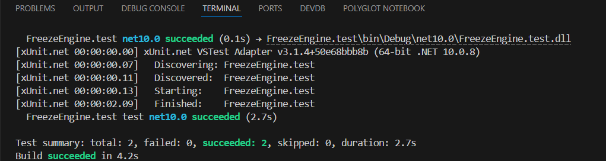

# SE_FreezeEngine
a simple implementation of the freeze engine containing simple tests for simple functionalities

> Made By **Fares Rostom**

I have used EF Library to manage the database connection, in the `DataAccess` classlib,\
and used a `Fixture` to start the database connection, and create the test data using the seeder I created, \
and done the tests on my function, `SessionManager.InvalidateAll` that succeeded the test, and here is the results:

and I assure you that I can explain **every line of code that I wrote**.